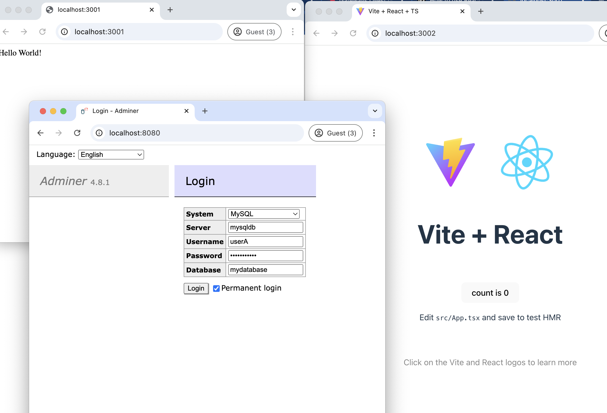
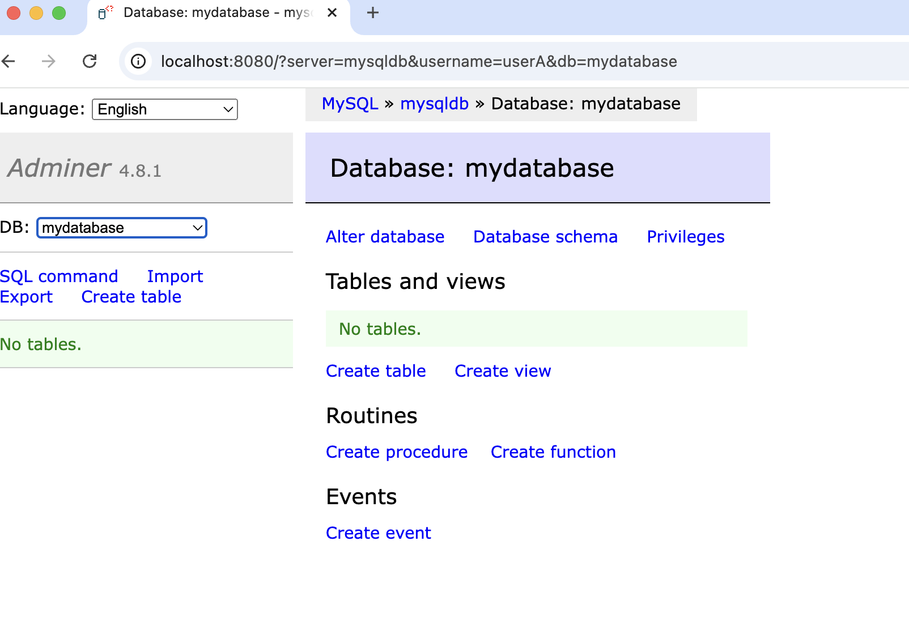

# Code Challenge 2024 

## Getting Started

This project utilizes Docker to simplify the setup and running of the application. Follow these steps to get started:

**Prerequisites:**

1. **Port Availability:** Ensure the following ports are available on your system:
   - Backend: 3001
   - Frontend: 3002
   - Database client (Adminer): 8080
   - MySQL Database: 3306

2. **Docker Desktop:** Install the latest version of Docker Desktop: [https://www.docker.com/products/docker-desktop/](https://www.docker.com/products/docker-desktop/)

3. **IDE:** Choose your preferred Integrated Development Environment (IDE) for working with the codebase.

**Installation:**

4. **Fork and Clone the Repository:** Fork and Clone this repository to your own GitHub account.

5. **Start the Application:**
   - Open a terminal in the project's root directory.
   - Run the command `docker compose up --build`. This will build the necessary Docker images and start the application's containers.

**Accessing the Application:**

- **Backend:** Access the backend API at `http://localhost:3001`
- **Frontend:** Access the frontend application at `http://localhost:3002`
- **Database:** Connect to the MySQL database using Adminer:
    - Go to `http://localhost:8080`
    - Use the following connection details:
        - **Server:** `mysqldb` (this is the service name in your `docker-compose.yml`)
        - **Username:** `userA`
        - **Password:** `P@ssw0rd123`
        - **Database:** `mydatabase`

**Setup:**

**Database Empty:**

**Troubleshooting:**

- If you encounter any issues, check the logs of the containers using `docker logs <container_name>` or `docker compose logs`.
- Ensure that the required ports are not being used by other applications.
- Refer to the Docker documentation for further assistance.
- jorge.solano@10pearls.com

**Development:**

- You can make changes to the codebase in your IDE.
- The changes will be reflected in the running application automatically (depending on your setup and the type of changes).
- To stop the application, use `Ctrl+C` in the terminal where you ran `docker compose up`.

**Additional Notes:**

- This README provides a basic guide to getting started. Refer to the project's documentation for more detailed information.
- Make sure to configure your environment variables and secrets appropriately for production deployments.
- Regularly update your Docker images to benefit from security updates and bug fixes.